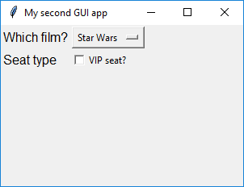

## CheckBox 

The CheckBox widget allows you to select or deselect an option.

--- task ---

Add `CheckBox` to the list of widgets at the start of your program.

--- code ---
---
language: python
line_numbers: true
line_number_start: 1
---
from guizero import App, CheckBox
--- /code ---

--- /task ---

--- task ---
Create the `App` and add a `CheckBox` widget.

--- code ---
---
language: python
line_numbers: true
line_number_start: 8
---
app = App(title="Seat type")
vip_seat = CheckBox(app, text="VIP seat?")
app.display()
--- /code ---

--- /task ---

--- task ---

Save and run your code. You should see the `CheckBox`, you should be able to tick and untick it.

--- /task ---

  
