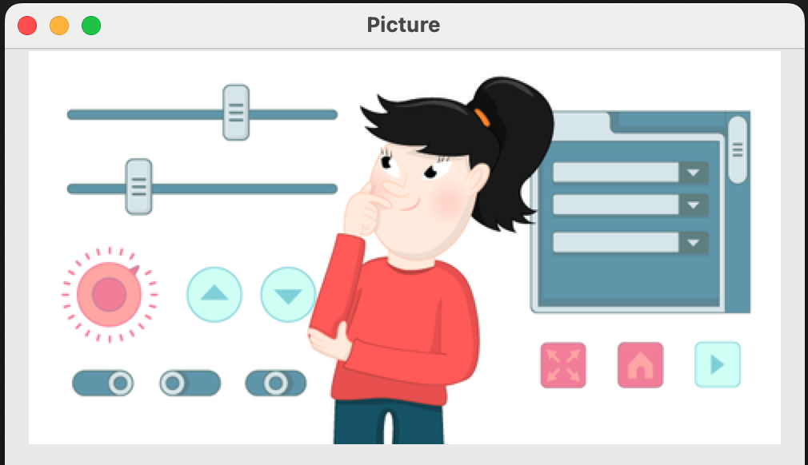

## Picture widget

You can add pictures to your GUI, as long as they are in GIF format. Sadly, animated GIFs will only display as stills.

- Find a picture in GIF format that you would like to use, or save an existing picture as a GIF file. Make sure that the picture is in the same folder as your `gui_test.py` Python file.

- Add `Picture` to your `import` statement.

- Add a `Picture` widget to the GUI:

    ```python
    my_cat = Picture(app, image="cat.gif")
    ```

- Press <kbd>F5</kbd> to run your code. You should see your picture appear on the GUI.

    


