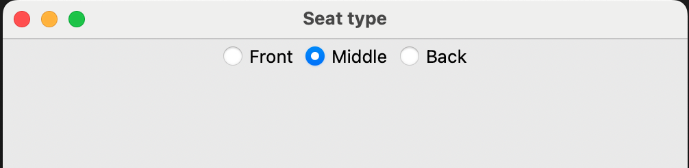

## ButtonGroup 

The ButtonGroup widget allows you to create a group of radio buttons to choose one of a set of options.

--- task ---

Start a new file. Add `ButtonGroup` to the list of widgets at the start of your program.

--- code ---
---
language: python
line_numbers: true
line_number_start: 1
---
from guizero import App, ButtonGroup
--- /code ---

--- /task ---

--- task ---
Create the `App` and add a `ButtonGroup` widget.

--- code ---
---
language: python
line_numbers: true
line_number_start: 8
---
app = App(title="Seat type")
row_choice = ButtonGroup(
    app, 
    options=[ ["Front", "F"], ["Middle", "M"],["Back", "B"] ],
    selected="M", 
    horizontal=True, 
)
app.display()
--- /code ---

--- /task ---

--- task ---

Save and run your code. You should see three buttons: the 'Middle' option should be selected when the program begins, and you should be able to switch between the options.

--- /task ---

