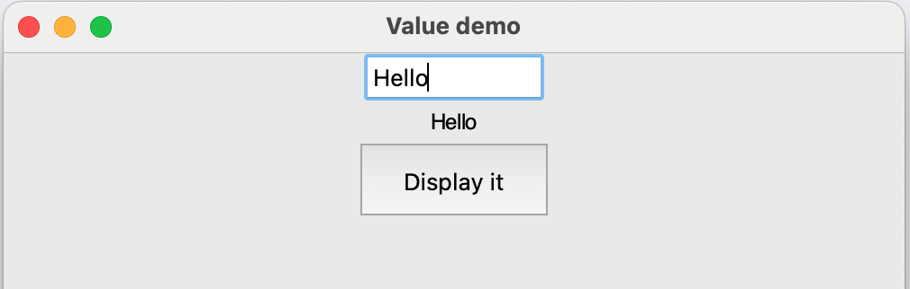

## Get a value

You can get the value of any widget, for example the text in a TextBox or the option selected in a Combo.

--- task ---

Start a new file. Add `TextBox`, `Text` and `PushButton` to the list of widgets at the start of your program.

--- code ---
---
language: python
line_numbers: true
line_number_start: 1
---
from guizero import App, TextBox, Text, PushButton
--- /code ---

--- /task ---

--- task ---
Create the `App` and add all three widgets.

--- code ---
---
language: python
line_numbers: true
line_number_start: 8
---
app = App(title="Value demo")
input_box = TextBox(app)
output_text = Text(app, text="???")
button = PushButton(app, text="Display it", command=update_text)
app.display()
--- /code ---

--- /task ---

--- task ---
Above the `App`, write a function `update_text` which takes the value that was written in the text box and writes it in the output box. 

--- code ---
---
language: python
line_numbers: true
line_number_start: 8
---
def update_text():
    output_text.value = input_box.value
--- /code ---

--- /task ---

--- task ---

Save and run your code. Type a message in the TextBox, then press the button. The message should be copied to the Text widget.

--- /task ---

