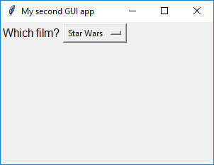

## Combo widget

The **Combo** widget allows you to select an option from a drop-down list.

- Add the `Combo` widget to your import statement.

- Add a `Combo` widget to the GUI:

    ```python
    film_choice = Combo(app, options=["Star Wars", "Indiana Jones", "Batman"], grid=[1,0], align="left")
    ```

    - We have specified the `app` parameter as usual to tell the Combo that the app is its master.
    - The `options` argument is a list of options we wish to display in the `Combo` widget.
    - Because we specified `layout=grid` in the app, we have to now include a `grid` argument with each widget, to tell it where to appear. The grid argument should be a list containing [x,y] values for where you would like the widget to appear on the grid, with [0,0] on the grid being the top left corner. We can also align the widget within the grid square, in this case on the left.

- Save your code and press F5 to run it. Note that the Combo appears in the very top left of the screen even though we specified its grid position as [1,0]. This is because empty grid squares have no height or width, so as grid square [0,0] is empty, it effectively doesn't exist.

- Add `Text` to your import statement, then add a `Text` widget in grid square [0,0] to provide some description of what the person will be selecting using the `Combo`:

    ```python
    film_description = Text(app, text="Which film?", grid=[0,0], align="left")
    ```

    Run the program to check that the `Text` and the `Combo` both display properly.

    

