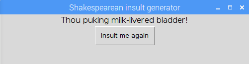

## What can you do now?

Try our [Shakespearean insult generator](https://projects.raspberrypi.org/en/projects/shakespearean-insult-generator/) project where you will write a Python script to generate insults, Elizabethan-style, and display them on a GUI.

--- print-only --- 

--- /print-only ---

Or, why not try out another [Python](https://projects.raspberrypi.org/en/projects?software%5B%5D=python) project.

