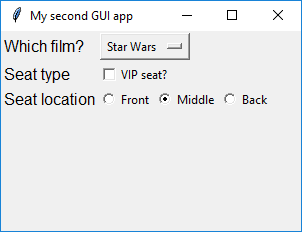

## ButtonGroup widget

The **ButtonGroup** widget allows you to create a group of radio buttons so that you can choose one of a set of options.

- Add the `ButtonGroup` widget to your import statement.

- Add a `ButtonGroup` widget to the GUI:

    ```python
    row_choice = ButtonGroup(app, options=[ ["Front", "F"], ["Middle", "M"],["Back", "B"] ],
    selected="M", horizontal=True, grid=[2,1], align="left")
    ```

    Let's look at this more closely:
    - `app` tells the buttons that the app is their boss.
    - `options` is a list of options which will appear as buttons. Each option is also a list containing the text that will appear, and a hidden value associated with that option.
    - `selected` tells the buttons which one is selected to begin with.
    - `horizontal` tells the buttons to display in a horizontal line.
    - `grid` is where these buttons will be placed on the grid.
    - `align` says to position the buttons on the left of the grid square.

    We have also added another `Text` widget in `[2,0]` to explain what the buttons are for.

- Press F5 to run your code. You should see the buttons. The 'middle' option should be selected when the program begins, and you should be able to switch between them.

    

