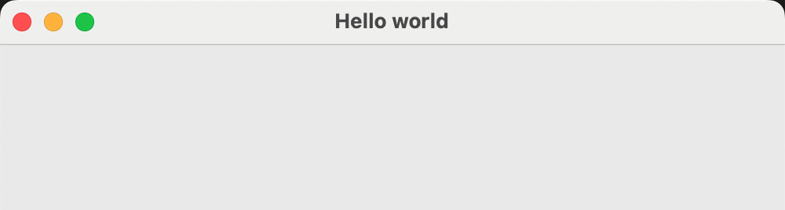

## Getting started

--- task ---
Make sure you have Python 3 installed. Install the `guizero` library by typing a command into the terminal:

### Windows / Mac OS
--- code ---
---
language: bash
line_numbers: false
---
pip3 install guizero
--- /code ---

### Raspberry Pi
--- code ---
---
language: bash
line_numbers: false
---
sudo apt-get install python3-guizero
--- /code ---


--- /task ---

- Open up Python 3 (IDLE).

- Click on **File** > **New File**, and save your file as `gui_test.py`.

- Add a line of code at the top of your file to import the `App` class from the `guizero` module:

    ```python
    from guizero import App
    ```

- Now add two more lines of code to create an `App` and then display it on the screen:

    ```python
    app = App(title="Hello world")
    app.display()
    ```

- Save your file and press <kbd>F5</kbd> to run it. You should see a GUI window that looks like this:

    

Congratulations, you have just built your first GUI app!
