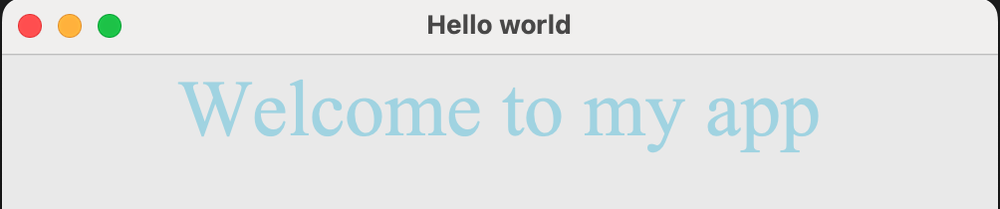

## Text widget

The text widget displays some text on the screen.

--- task ---

Add `Text` to the list of widgets at the start of your program.

--- code ---
---
language: python
line_numbers: true
line_number_start: 1
---
from guizero import App, Text
--- /code ---

--- /task ---

--- task ---

Create a `Text` widget

--- code ---
---
language: python
line_numbers: true
line_number_start: 1
line_highlights: 3
---
from guizero import App, Text
app = App(title="Hello world")
welcome_message = Text(app, text="Welcome to my app")
app.display()
--- /code ---

--- /task ---

--- task ---

Run your code. You should see the text displayed on your GUI:

--- /task ---

--- task ---

You can change the size, font and colour of your text like this:

--- code ---
---
language: python
line_numbers: true
line_number_start: 1
line_highlights: 6-8
---
from guizero import App, Text
app = App(title="Hello world")
welcome_message = Text(
        app, 
        text="Welcome to my app", 
        size=40, 
        font="Times New Roman", 
        color="lightblue"
)
app.display()
--- /code ---

--- /task ---