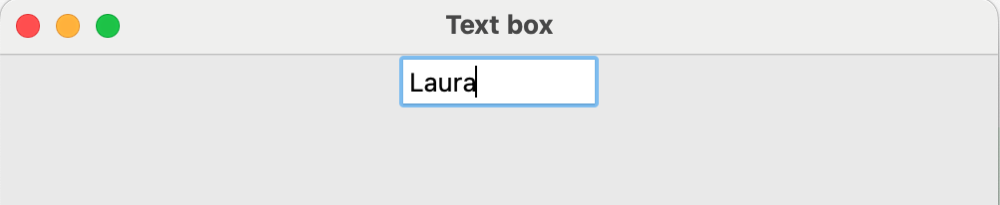

## TextBox widget

A TextBox widget allows the user to type in data.

--- task ---

Add `TextBox` to the list of widgets at the start of your program.

--- code ---
---
language: python
line_numbers: true
line_number_start: 1
---
from guizero import App, TextBox
--- /code ---

--- /task ---

--- task ---

Create a `TextBox` widget

--- code ---
---
language: python
line_numbers: false
---
my_name = TextBox(app)

--- /code ---

--- /task ---

--- task ---

You should see a small text box appear. 

--- /task ---

