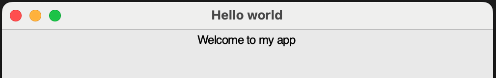

## Text widget

Probably the simplest widget you can add is the `Text` widget, which displays some text on the screen.

- Add `Text` to the `import` statement (check back in the **Adding widgets** section if you are not sure how to do this).

- Add a `Text` widget to the GUI (check back in the **Adding widgets** section if you are not sure where to put this code):

    ```python
    welcome_message = Text(app, text="Welcome to my app")
    ```

    Here we have created a `Text` widget with the name `welcome_message`. The first __argument__ (in the brackets) tells the widget who its boss is! To be more specific, we are telling this `Text` widget that it will be controlled by the `app` object that we created earlier. The first argument given to any widget always tells it the name of its boss (or master).

- Run your code by pressing <kbd>F5</kbd>. You should see this text displayed on your GUI.

    

--- collapse ---

---
title: Something has gone wrong!
---

Your code should look like this, with `Text` imported at the start and `welcome_message` created before `app.display()`:

```python
from guizero import App, Text

app = App(title="Hello world")

welcome_message = Text(app, text="Welcome to my app")

app.display()
```

--- /collapse ---

- Did you notice that we could tell the `Text` widget what content we wanted it to display by specifying `text="Welcome to my app"`? This is called a **keyword argument**, because we have specified the keyword `text` and the value we want. We can specify other keyword arguments too by just adding them after the `text` one and separating them by commas.

    ```python
    welcome_message = Text(app, text="Welcome to my app", size=40, font="Times New Roman", color="lightblue")
    ```

Here, we have used keyword arguments for the `size`, `font`, and `color` (note the American spelling!).


You can specify any font your computer has installed. Colours can be specified as colour names, but not every possible colour has a name, so you can also use Hex codes (e.g. `#ff0000`) to define colours.
