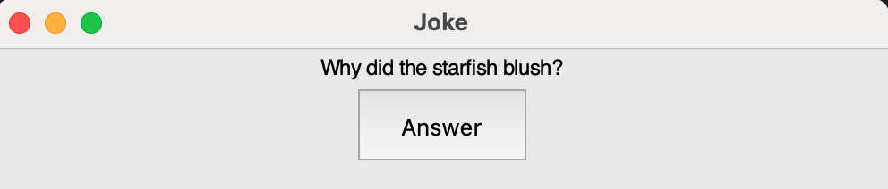

## PushButton widget

A PushButton widget creates a button you can press. When the button is pressed, a function is called.

--- task ---

Add `PushButton` to the list of widgets at the start of your program.

--- code ---
---
language: python
line_numbers: true
line_number_start: 1
---
from guizero import App, Text, PushButton
--- /code ---

--- /task ---

--- task ---
This GUI will display a joke, with a button to press to display the punch line.

**Above** the code which creates the GUI app, write a function called `punch_line`:

--- code ---
---
language: python
line_numbers: true
line_number_start: 4
---
def punch_line():
    message.value = "Because the sea weed"
--- /code ---

--- /task ---

--- task ---
Create the `App` and add a `Text` widget containing the start of the joke.

--- code ---
---
language: python
line_numbers: true
line_number_start: 8
---
app = App(title="Joke")
message = Text(app, text="Why did the starfish blush?")
app.display()
--- /code ---

--- task ---

Create a `PushButton` widget. When the button is pressed, the function `punch_line` will be called.

--- code ---
---
language: python
line_numbers: true
line_number_start: 10
---
update_text = PushButton(app, command=punch_line, text="Answer")

--- /code ---

--- /task ---

--- task ---

Run your code. You should see a joke, and when you press the button, the punch line is displayed. 

--- /task ---

