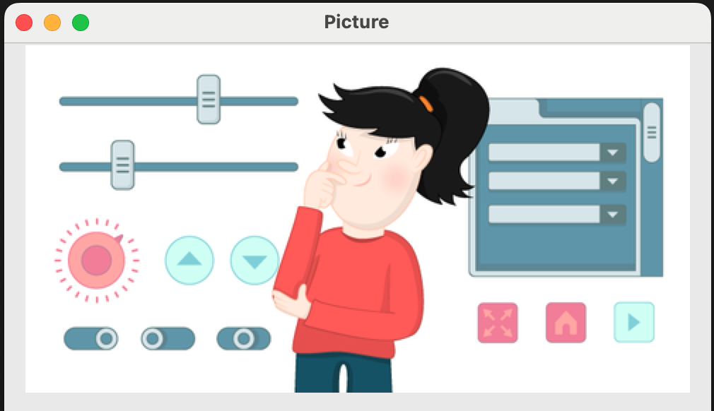

## Picture 

You can add a picture to a GUI with the Picture widget.

--- task ---
Find a picture, and save it in the same folder as your Python file.
--- /task ---

--- task ---

Add `Picture` to the list of widgets at the start of your program.

--- code ---
---
language: python
line_numbers: true
line_number_start: 1
---
from guizero import App, Picture
--- /code ---

--- /task ---

--- task ---
Create the `App` and add a `Picture` widget.

--- code ---
---
language: python
line_numbers: true
line_number_start: 8
---
app = App(title="Picture")
my_cat = Picture(app, image="cat.gif")
app.display()
--- /code ---

--- /task ---

--- task ---

Save and run your code. You should see your picture appear in the GUI window. 

--- /task ---

