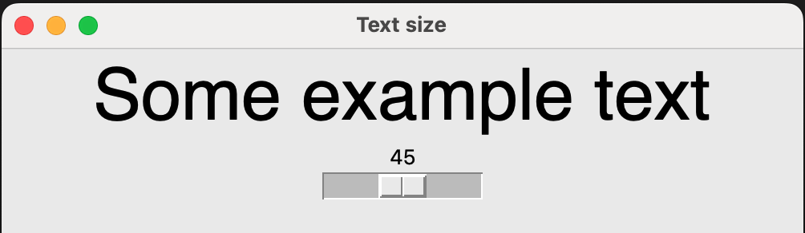

## Slider widget

A slider lets users pick a value from a range of values easily, rather like moving a volume control slider.

- Above the code which creates the GUI app, write a function `change_text_size` which will be called when the slider is moved.

    ```python
    def change_text_size(slider_value):
        welcome_message.size = slider_value
    ```

    This function has a parameter called `slider_value`. When the slider is moved, the current value of the parameter will **automatically** be sent to the function, so we must give it a name. We have decided to call the parameter `slider_value`. 
    
    The code inside the function sets the `size` of the `welcome_message` to the current slider value.

- Add the `Slider` widget to your `import` statement.

- Add a `Slider` to the GUI:

    ```python
    text_size = Slider(app, command=change_text_size, start=10, end=80)
    ```

    The `command` argument specifies the function that will be called when the slider is moved (i.e. the `change_text_size` function we just created).
    
    The values of the `start` and `end` arguments determine the largest and smallest values of the slider. We have specified these so that the font does not get too large or small — the smallest it can be is 10pt and the largest is 80pt.

- Save your code and press <kbd>F5</kbd> to run it. Move the slider from side to side and watch the size of the text change.

    


