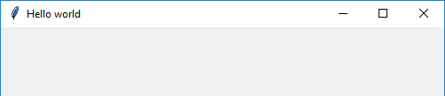
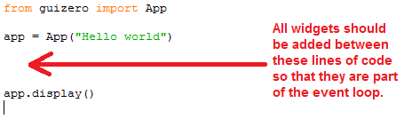
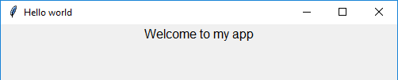
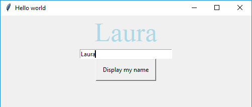
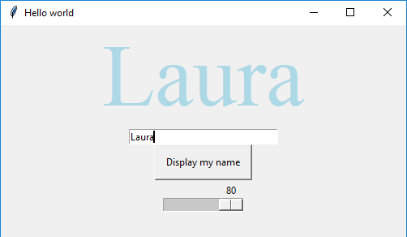
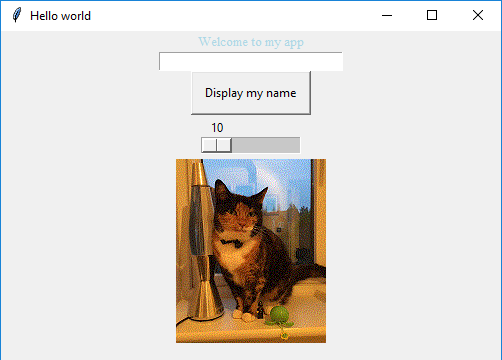

# Getting started with GUIs

In this resource you will learn how to make simple GUIs in Python

## What is a GUI?

GUI stands for **G**raphical **U**ser **,** and it is pronounced "gooey". If you have written Python programs before, all of your input and output will probably have been done via text appearing on the screen or being typed in by the user. Adding a GUI to your program lets the user interact with it using buttons, drop downs, text boxes, menus and other familiar user interface controls.

## Getting started

Before you start, make sure that you have installed the **guizero** library using the [software installation instructions](software.md).

1. Open up Python 3 (IDLE)

    

1. Click on File > New File and save your file as `gui_test.py`

1. Add a line of code at the start of your file to import the App class from the guizero library

    ```python
    from guizero import App
    ```

1. Now add two more lines of code to create an `App` and then display it on the screen

    ```python
    app = App(title="Hello world")
    app.display()
    ```

1. Save your file and press F5 to run it. You should see a GUI window that looks like this:

    

Congratulations, you have built your first GUI app!

## Adding widgets

Let's start adding content to the GUI. We will refer to items you can add to a GUI (such as text, text boxes, buttons etc.) as **widgets**. There are a couple of rules to follow when adding a widget.

1. If you want to use a new type of widget, you must import it. The first line of code in your program looks like this:

    ```python
    from guizero import App
    ```

    As an example, if you wanted to use the `Text` widget, you would add it to the import line, like this:

    ```python
    from guizero import App, Text
    ```

    We will ask you to import various types of widget throughout this guide. Each type of widget only needs to be added to the import list once, and then you can use it as many times as you want on your GUI.

1. All widgets must be added inside the **event loop**, which means between the line of code where you create the app, and the `app.display()` line of code:

    

    This is because the line of code `app.display()` starts the **event loop**. The GUI will be waiting for the user to do things such as click on a button - these are called **events**. The GUI will constantly check whether anything new has happened and automatically update the display if necessary. If widgets are not placed within the event loop, they will not appear on the GUI or work properly.

    Throughout this guide, we will ask you to add widgets **inside the event loop** which means anywhere between these two lines of code.


## Text widget

Probably the simplest widget you can add is the Text widget, which displays some text on the screen.

1. Add `Text` to the import statement (read step 1 of the "Adding widgets" section if you are not sure how to do this).

1. **Inside the event loop** create a `Text` widget like this (read step 2 of the "Adding widgets" section if you are not sure where to put this code)

    ```python
    welcome_message = Text(app, text="Welcome to my app")
    ```

    Here we have created a `Text` widget with the name `welcome_message`. The first __argument__ (in the brackets) tells the widget who its boss is! To be more specific, we are telling this `Text` widget that it will be controlled by the `app` object which we created earlier. The first argument given to any widget always tells it the name of its boss (or 'master'). The second argument tells the widget that we want the text displayed to be "Welcome to my app".

1. Save and run your code by pressing F5. You should see this text displayed on your GUI.

    

1. Did you notice that we could tell the `Text` widget what content we wanted it to display by specifying `text="Welcome to my app"`? This is called a keyword argument, because we have specified the key word `text` and the value we want. We can specify other key word arguments too, just add them on to the end, separated by commas.

    ```python
    welcome_message = Text(app, text="Welcome to my app", size=40, font="Times New Roman", color="lightblue")
    ```

    Here, we have used keyword arguments for the `size`, `font` and `color` (note the American spelling!).

    

    You can specify any font your computer has installed and colours can be specified either as colour names (for predefined colours) or as hex codes (e.g. #ff0000).

## TextBox widget

TextBox widgets are used to let the user type in data - a bit like the GUI version of the `input()` function you may have used before. Here's how to add one.

1. Add the `TextBox` widget to your import statement

1. Inside the event loop, create a `TextBox` like this:

    ```python
    my_name = TextBox(app)
    ```

1. Save your program and press F5 to run it. You should see a small text box appear. There is a keyword parameter `width` which you can use if you wish to make the box wider.

    

## PushButton widget

PushButton widgets are there to be pressed! Pressing a button causes a function to be called.

1. **Outside** the event loop, write a function which will be called when the button is pressed. It is a good idea to put your function at the start of your program, immediately after the `import` line.

    ```python
    def say_my_name():
        welcome_message.set( my_name.get() )
    ```

    This function refers to the `Text` widget (`welcome_message`) and sets its value to what was typed into the `TextBox` widget (`my_name`).
    You can use the `get()` and `set()` functions with many widgets to retrieve their current value and set it to something new.

1. Add the `PushButton` widget to your import statement.

1. Inside the event loop, create a `PushButton` like this:

    ```python
    update_text = PushButton(app, command=say_my_name, text="Display my name")
    ```

    The first argument tells the PushButton that the app is its boss. Then we use two keyword arguments - `command` tells the button which function to call when it is pressed, and `text` is the text which will be displayed on the button.

1. Save the file and press F5 to run it. Type your name into the text box and then press the button. You should see your name displayed in the text widget.

    

    You have now experienced the basis of how the event loop works. The GUI waits for an event (in this case, you clicking on the button) and it calls a function in response to the event. This function may contain code to change something on the GUI, and if so, the display is updated accordingly.


## Slider widget

A slider lets users move within a range of values easily, rather like moving a volume switch up or down.

1. **Outside** the event loop, write a function which will be called when the slider is moved.

    ```python
    def change_text_size(slider_value):
        welcome_message.font_size(slider_value)
    ```

    This function has a parameter called `slider_value`. When the slider is moved, the current value of the slider will **automatically be sent to the function**, so we must give it a name. We have chosen to call this parameter `slider_value`. The code inside the function sets the `font_size` of the `welcome_message` to the current slider value.

1. Add the `Slider` widget to your import statement.

1. Add code **inside the event loop** to create the `Slider` widget:

    ```python
    font_size = Slider(app, command=change_text_size, start=10, end=80)
    ```

    The `command` is the function that will be called when the slider is moved, i.e. the function we just wrote. Start and end values are specified for the biggest and smallest values the slider can have. We have specified these so that the font does not get too small - the smallest it can go is 10pt and the largest is 80pt.

1. Save your code and press F5 to run it. Move the slider from side to side and watch the size of the text change.

    


## Picture widget

You can add pictures to your GUI, as long as they are in GIF format. Sadly, animated gifs will only display as stills.

1. Find a picture in GIF format that you would like to use. Save the picture in the same folder as your `gui_test.py` Python file.

1. Add the `Picture` widget to your import statement.

1. Add code **inside the event loop** to create the `Picture` widget.

    ```python
    my_cat = Picture(app, image="cat.gif")
    ```

1. Save your code and press F5 to run it. You should see your picture appear on the GUI.

    


## What next?

You have now learnt how to use some simple GUI widgets. The full code for this part of the guide can be found [here](code/test_gui.py) if you want to see a full working example.

Head over to [worksheet 2](worksheet2.md) to master some more complicated GUI widgets.
