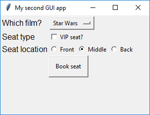
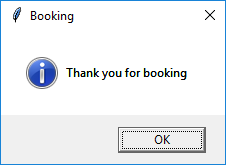
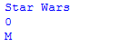

# Getting started with GUIs (part 2)

Now let's look at some more complicated GUI widgets: combo boxes, check boxes, radio buttons and the menu bar. We will make a simple cinema booking GUI to demonstrate these widgets.

## Getting started

1. Create a new file and save it as `gui_test2.py`.

1. Add a line of code at the start of your file to import the App class from the guizero library:

    ```python
    from guizero import App
    ```

1. Now add two more lines of code to create an `App` and then display it on the screen:

    ```python
    app = App(title="My second GUI app", width=300, height=200, layout="grid")
    app.display()
    ```

    This time we have specified some new keyword arguments: `width` and `height` change the size of the app window and `layout` allows us to set out our widgets on an invisible grid.

## Combo widget

The **Combo** widget allows you to select an option from a drop-down list.

1. Add the `Combo` widget to your import statement.

1. Add a `Combo` widget to the GUI:

    ```python
    film_choice = Combo(app, options=["Star Wars", "Indiana Jones", "Batman"], grid=[0,1], align="left")
    ```

    - We have specified the `app` parameter as usual to tell the Combo that the app is its master.
    - The `options` argument is a list of options we wish to display in the `Combo` widget.
    - Because we specified `layout=grid` in the app, we have to now include a `grid` argument with each widget, to tell it where to appear. The grid argument should be a list containing [x,y] values for where you would like the widget to appear on the grid, with [0,0] on the grid being the top left corner. We can also align the widget within the grid square, in this case on the left.

1. Save your code and press F5 to run it. Note that the Combo appears in the very top left of the screen even though we specified its grid position as [0,1]. This is because empty grid squares have no height or width, so as grid square [0,0] is empty, it effectively doesn't exist.

1. Add `Text` to your import statement, then add a `Text` widget in grid square [0,0] to provide some description of what the person will be selecting using the `Combo`:

    ```python
    film_description = Text(app, text="Which film?", grid=[0,0], align="left")
    ```

    Run the program to check that the `Text` and the `Combo` both display properly.

    

## CheckBox widget

The **CheckBox** widget allows you to select or unselect a true or false option.

1. Add the `CheckBox` widget to your import statement.

1. Add a `CheckBox` widget to the GUI:

    ```python
    vip_seat = CheckBox(app, text="VIP seat?", grid=[1,1], align="left")
    ```

    We also chose to add a `Text` widget in grid `[1,0]` to explain what the checkbox is for.

1. Press F5 to run your code. You should see the checkbox appear and be able to tick and untick it.

    


## ButtonGroup widget

The **ButtonGroup** widget allows you to create a group of radio buttons so that you can choose one of a set of options.

1. Add the `ButtonGroup` widget to your import statement.

1. Add a `ButtonGroup` widget to the GUI:

    ```python
    row_choice = ButtonGroup(app, options=[ ["Front", "F"], ["Middle", "M"],["Back", "B"] ],
    selected="M", horizontal=True, grid=[2,1], align="left")
    ```

    Let's look at this more closely:
    - `app` tells the buttons that the app is their boss.
    - `options` is a list of options which will appear as buttons. Each option is also a list containing the text that will appear, and a hidden value associated with that option.
    - `selected` tells the buttons which one is selected to begin with.
    - `horizontal` tells the buttons to display in a horizontal line.
    - `grid` is where these buttons will be placed on the grid.
    - `align` says to position the buttons on the left of the grid square.

    We have also added another `Text` widget in `[2,0]` to explain what the buttons are for.

1. Press F5 to run your code. You should see the buttons. The 'middle' option should be selected when the program begins, and you should be able to switch between them.

    

## Finishing the program

1. Finally, add `PushButton` to the import list, then add a `PushButton` widget in `[3,1]` which calls a function called `do_booking` when it is pressed.

    ```python
    book_seats = PushButton(app, command=do_booking, text="Book seat", grid=[3,1], align="left")
    ```

    

1. Add `info` (all lower case) to the import statement to allow us to use the info box function from guizero.

1. **Outside** the GUI, write the function `do_booking()`. This will pop up an information box.

    ```python
    def do_booking():
        info("Booking", "Thank you for booking")
    ```

    

1. You probably want to know how to retrieve the options the user chose. Add this code to your `do_booking()` function:

    ```python
    print( film_choice.get() )
    print( vip_seat.get_value() )
    print( row_choice.get() )
    ```

    Notice that the `CheckBox` returns `0` if it is not checked and `1` if it is checked, and the `ButtonGroup` returns the hidden value (`F`, `M` or `B`) rather than the full text.

    


## What next?
Try making your own GUI program. Perhaps you could take an old program you wrote and give it a GUI? 
