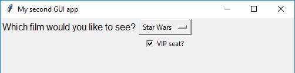

# Getting started with GUIs (Part 2)

Now let's look at some more complicated GUI widgets - combo boxes, check boxes, radio buttons and the menu bar. We will make a simple cinema booking GUI to demonstrate.

## Getting started

1. Create a new file and save it as `gui_test2.py`

1. Add a line of code at the start of your file to import the App class from the guizero library

    ```python
    from guizero import App
    ```

1. Now add two more lines of code to create an `App` and then display it on the screen

    ```python
    app = App(title="My second GUI app", layout="grid")
    app.display()
    ```

    This time we have specified a new keyword argument - `layout`. We will use this to set out our widgets on an invisible grid.

## Combo widget

The `Combo` widget allows you to select an option from a drop down list.

1. Add the `Combo` widget to your import statement.

1. Inside the event loop, create a `Combo` like this:

    ```python
    film_choice = Combo(app, options=["Star Wars", "Indiana Jones", "Batman"], grid=[0,1])
    ```

    - We have specified the `app` parameter as usual to tell the Combo that the app it its master.
    - The `options` argument is a list of options we wish to display in the `Combo` widget
    - Because we specified `layout=grid` in the app, we have to now include a `grid` argument with each widget, to tell it where to appear. The grid argument should be a list containing [x,y] values for where you would like the widget to appear on the grid, with [0,0] on the grid being the top left corner.

1. Save your code and press F5 to run it. Note that the Combo appears in the very top left of the screen even though we specified its grid position as [0,1]. This is because empty grid squares have no height or width, so as grid square [0,0] is empty, it effectively doesn't exist.

1. Add a `Text` widget in grid square [0,0] to provide some description of what the person will be selecting using the `Combo`:

    ```python
    film_description = Text(app, text="Which film would you like to see?", grid=[0,0])
    ```

    Don't forget to also add `Text` to your import statement. Run the program to check that the `Text` and the `Combo` both display properly.

    

## CheckBox widget

The `CheckBox` widget allows you to select or unselect a true or false option.

1. Add the `CheckBox` widget to your import statement

1. Inside the event loop, create a `CheckBox` widget like this:

    ```python
    vip_seat = CheckBox(app, text="VIP seat?", grid=[1,1])
    ```

1. Save your code and press F5 to run it. You should see the checkbox appear and be able to tick and untick it.

    


## ButtonGroup widget

The `ButtonGroup` widget allows you to create a group of radio buttons so that you can choose one of a set of options.

1. Add the `ButtonGroup` widget to your import statement

1. Inside the event loop, create a `ButtonGroup` widget like this:

    
